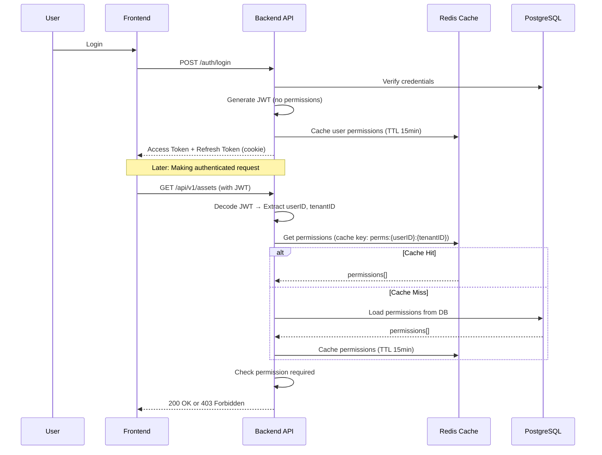

# JWT Token Structure

## Overview

Rediver uses JWT (JSON Web Tokens) for authentication with a **hybrid approach**: JWTs contain minimal user identity claims, while permissions are fetched dynamically from Redis cache or the database.

## Why Hybrid JWT + Redis?

### Problem with Traditional JWT
- **Large Token Size:** Embedding all permissions in JWT resulted in 2.5KB+ tokens
- **Cookie Limits:** Browsers limit cookies to 4KB, causing failures
- **No Real-time Updates:** Permission changes required waiting for token expiry (15 min)

### Solution: Hybrid System
- **Small JWT:** Only essential identity claims (~200 bytes)
- **Dynamic Permissions:** Fetched from Redis cache (<1ms) or DB
- **Real-time Updates:** Cache invalidation enables instant permission changes

---

## Token Structure

### Access Token Claims

```json
{
  "sub": "66666666-6666-6666-6666-666666666666",
  "email": "user@example.com",
  "tenant_id": "bbbbbbbb-bbbb-bbbb-bbbb-bbbbbbbbbbbb",
  "role": "admin",
  "is_admin": true,
  "exp": 1737589200,
  "iat": 1737588300,
  "iss": "rediver-api"
}
```

### Claims Description

| Claim | Type | Description |
|-------|------|-------------|
| `sub` | string | User ID (UUID) |
| `email` | string | User email address |
| `tenant_id` | string | Active tenant ID (UUID) |
| `role` | string | User's role name (e.g., "admin", "member") |
| `is_admin` | boolean | Whether user is a tenant administrator |
| `exp` | int64 | Token expiration time (Unix timestamp) |
| `iat` | int64 | Token issued at time (Unix timestamp) |
| `iss` | string | Token issuer ("rediver-api") |

> **📌 Note:** `permissions` array is **NOT** included in JWT. Permissions are fetched from Redis/DB on each request.

---

## Token Lifecycle



---

## Token Lifecycle

### Architecture Flow


---

## Token Sizes

| Role | Before (with permissions) | After (no permissions) | Reduction |
|------|---------------------------|------------------------|-----------|
| **Owner** | 2,500 bytes | 200 bytes | **92%** |
| **Admin** | 2,300 bytes | 200 bytes | **91%** |
| **Member** | 1,500 bytes | 200 bytes | **87%** |

---

## Token Duration

| Token Type | Duration | Storage | Renewal |
|------------|----------|---------|---------|
| **Access Token** | 15 minutes | Memory (Zustand store) | Via refresh token |
| **Refresh Token** | 7 days | HttpOnly cookie | On expiry → re-login |

---

## Security Considerations

### What's in the Token
✅ User identity (ID, email)  
✅ Tenant context (tenant ID, role)  
✅ Administrative flag  
❌ Permissions (fetched dynamically)

### Why This is Secure
1. **Smaller Attack Surface:** Less sensitive data in JWT
2. **Real-time Revocation:** Cache invalidation removes access instantly
3. **No Permission Tampering:** Permissions verified server-side every request
4. **Audit Trail:** All permission checks logged

### Token Validation
```go
// Extract claims from JWT
claims, err := jwt.ParseToken(accessToken)

// Get permissions from cache/DB (NOT from JWT)
permissions, err := permissionService.GetUserPermissionsFromCache(
    ctx, claims.UserID, claims.TenantID,
)

// Check permission
if !slices.Contains(permissions, "assets:write") {
    return http.StatusForbidden
}
```

---

## Real-time Permission Sync

### X-Permission-Version Header

Every authenticated API response includes the `X-Permission-Version` header. This enables real-time permission updates without WebSockets or constant polling.

**Flow:**
```
1. User makes API request
2. Backend validates JWT, fetches permissions from Redis
3. Backend includes X-Permission-Version: {timestamp} in response
4. Frontend compares with stored version
5. If different → Frontend calls GET /api/v1/me/permissions
```

**Backend Implementation:**

```go
// Middleware automatically adds header to tenant-scoped responses
func PermissionVersion(permSvc *app.PermissionService) func(http.Handler) http.Handler {
    return func(next http.Handler) http.Handler {
        return http.HandlerFunc(func(w http.ResponseWriter, r *http.Request) {
            userID := GetUserID(r.Context())
            tenantID := GetTenantID(r.Context())

            if userID != "" && tenantID != "" {
                version := permSvc.GetPermissionVersion(r.Context(), userID, tenantID)
                if version > 0 {
                    w.Header().Set("X-Permission-Version", strconv.FormatInt(version, 10))
                }
            }
            next.ServeHTTP(w, r)
        })
    }
}
```

**When Version Changes:**
- User's role is modified
- Permissions are assigned/removed from role
- User is removed from tenant
- `InvalidatePermissions(ctx, userID, tenantID)` is called

---

## Implementation

### Backend: JWT Generation

```go
// File: api/pkg/jwt/jwt.go

type Claims struct {
    Sub      string `json:"sub"`       // User ID
    Email    string `json:"email"`
    TenantID string `json:"tenant_id"`
    Role     string `json:"role"`
    IsAdmin  bool   `json:"is_admin"`
    jwt.RegisteredClaims
}

func (c *Client) GenerateTenantScopedAccessToken(
    userID, email, tenantID, role string,
    isAdmin bool,
) (string, error) {
    now := time.Now()
    claims := Claims{
        Sub:      userID,
        Email:    email,
        TenantID: tenantID,
        Role:     role,
        IsAdmin:  isAdmin,
        RegisteredClaims: jwt.RegisteredClaims{
            ExpiresAt: jwt.NewNumericDate(now.Add(c.accessTokenDuration)),
            IssuedAt:  jwt.NewNumericDate(now),
            Issuer:    "rediver-api",
        },
    }
    
    token := jwt.NewWithClaims(jwt.SigningMethodHS256, claims)
    return token.SignedString(c.secretKey)
}
```

### Frontend: Token Storage

```typescript
// File: ui/src/stores/auth-store.ts

interface AuthState {
  accessToken: string | null  // JWT access token (memory only)
  user: AuthUser | null
  permissions: string[] | null  // Fetched from API
}

// After login: fetch permissions from API
const login = (accessToken: string) => {
  set({ accessToken, status: 'authenticated' })
  
  // Fetch permissions from /api/v1/me/permissions
  loadPermissions()
}
```

---

## Migration Notes

### Breaking Changes
❌ **Old JWT:** Contains `permissions` array  
✅ **New JWT:** No permissions, smaller size

### Backward Compatibility
- Old clients will fail if they expect `permissions` in JWT
- Update frontend to fetch permissions from `/api/v1/me/permissions`

---

## Related Documentation

- [Authentication Guide](../guides/authentication.md) - Full authentication flow
- [Redis Setup](../operations/redis-setup.md) - Permission cache configuration
- [Permissions Guide](../guides/permissions.md) - Permission system overview

---

## Troubleshooting

### Token Too Large Error
**Symptom:** `431 Request Header Fields Too Large`

**Solution:** ✅ Already fixed! New tokens are ~200 bytes (vs 2.5KB before)

### Permissions Not Updating
**Symptom:** Permission changes don't reflect immediately

**Solution 1:** Check `X-Permission-Version` header
- Every response includes this header
- When permissions change, version is incremented
- Frontend should auto-refresh on version change

**Solution 2:** Invalidate cache manually:
```bash
redis-cli DEL "perms:{userID}:{tenantID}"
```

### Missing Permissions in Response
**Symptom:** `/api/v1/me/permissions` returns `{"permissions": []}`

**Solution:** Assign permissions to user's role in database:
```sql
INSERT INTO role_permissions (role_id, permission_id)
VALUES ('{roleID}', '{permissionID}');
```
