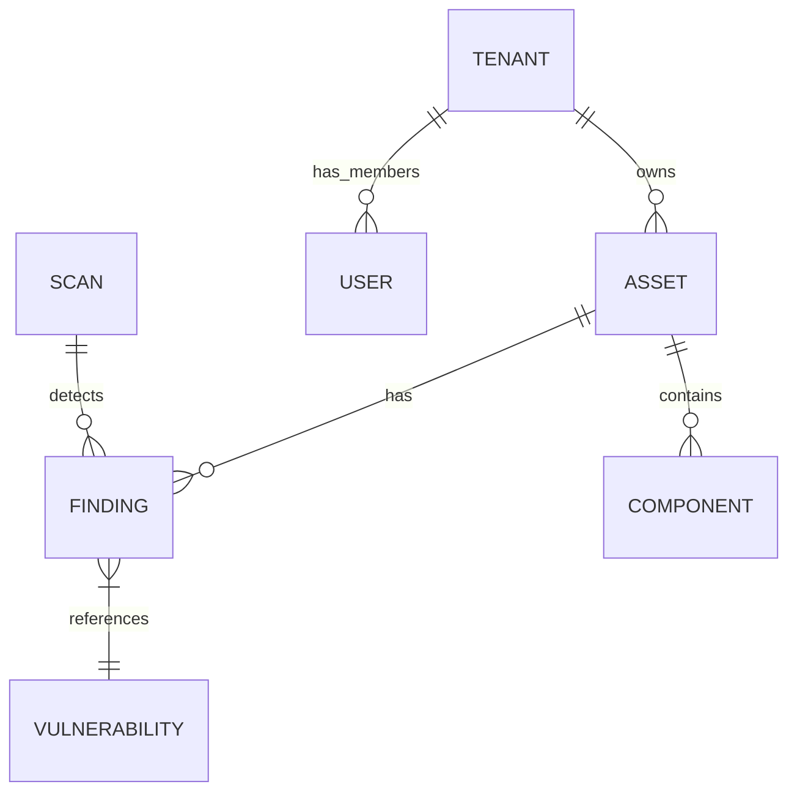

# Schema Overview

## Core Domains

### 1. Identity & Access (IAM)
- **`users`**: Global users table.
- **`tenants`**: Organization/Tenant boundaries.
- **`tenant_members`**: Link between users and tenants (role assignment).
- **`roles`**: RBAC role definitions.
- **`permissions`**: Granular system permissions.
- **`role_permissions`**: Mapping of permissions to roles.

### 2. Assets Management
- **`assets`**: Core entity (servers, clouds, apps).
- **`asset_types`**: Definitions of asset categories.
- **`asset_groups`**: Logical grouping of assets (tag-based or static).
- **`components`**: Software components/libraries installed on assets.

### 3. Vulnerability Management
- **`findings`**: Security issues found on assets.
- **`vulnerabilities`**: Vulnerability definitions (CVEs).
- **`scans`**: Records of scan executions.
- **`scan_profiles`**: Configuration for scan jobs.

### 4. Operations
- **`agents`** (formerly workers): Distributed scan agents.
- **`audit_logs`**: System audit trail.
- **`jobs`**: Background job entries.

## Relationships Diagram

