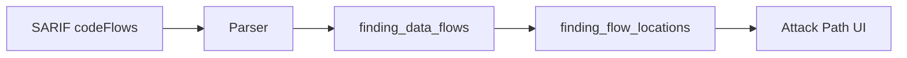

# Data Flow Tracking

> **Status**: ✅ Implemented
> **Version**: v1.0
> **Released**: 2026-01-29

## Overview

Data Flow Tracking stores and visualizes attack paths from SAST scanners, showing how tainted data flows from source to sink. This enables developers to understand vulnerability context and identify the best remediation point.

## Problem Statement

Traditional vulnerability reports show only the sink location:
```
SQL Injection in handlers/user.go:35
```

This doesn't answer critical questions:
- Where does the tainted data come from?
- What transformations happen along the way?
- Where is the best place to add sanitization?

## Solution: SARIF codeFlows Support

The platform ingests SARIF `codeFlows` and normalizes them into queryable tables:



## Data Model

### finding_data_flows Table

Container for a complete data flow path:

```sql
CREATE TABLE finding_data_flows (
    id UUID PRIMARY KEY,
    finding_id UUID NOT NULL REFERENCES findings(id) ON DELETE CASCADE,
    flow_index INTEGER NOT NULL DEFAULT 0,  -- Order when multiple flows
    message TEXT,                            -- Flow description
    importance VARCHAR(20) DEFAULT 'essential',
    created_at TIMESTAMPTZ DEFAULT NOW(),
    CONSTRAINT uq_finding_data_flow UNIQUE (finding_id, flow_index)
);
```

### finding_flow_locations Table

Individual steps in the data flow:

```sql
CREATE TABLE finding_flow_locations (
    id UUID PRIMARY KEY,
    data_flow_id UUID NOT NULL REFERENCES finding_data_flows(id) ON DELETE CASCADE,
    step_index INTEGER NOT NULL,
    location_type VARCHAR(20) NOT NULL DEFAULT 'intermediate',

    -- Physical location
    file_path VARCHAR(1000),
    start_line INTEGER,
    end_line INTEGER,
    start_column INTEGER,
    end_column INTEGER,
    snippet TEXT,

    -- Logical location
    function_name VARCHAR(500),
    class_name VARCHAR(500),
    fully_qualified_name VARCHAR(1000),
    module_name VARCHAR(500),

    -- Context
    label VARCHAR(500),          -- Taint variable name
    message TEXT,                -- Step description
    nesting_level INTEGER DEFAULT 0,
    importance VARCHAR(20) DEFAULT 'essential',

    CONSTRAINT uq_flow_step UNIQUE (data_flow_id, step_index)
);
```

## Location Types

| Type | Description | SARIF Mapping |
|------|-------------|---------------|
| `source` | Where tainted data enters | First location in threadFlow |
| `intermediate` | Transformation steps | Middle locations |
| `sink` | Where vulnerability occurs | Last location in threadFlow |
| `sanitizer` | Where data is cleaned | Locations with sanitizer role |

### Domain Validation

```go
const (
    LocationTypeSource       = "source"
    LocationTypeIntermediate = "intermediate"
    LocationTypeSink         = "sink"
    LocationTypeSanitizer    = "sanitizer"
)

// Validated at creation
func NewFindingFlowLocation(dataFlowID, stepIndex, locationType) {
    if !IsValidLocationType(locationType) {
        return nil, shared.ErrValidation
    }
}
```

## Example: SQL Injection Flow

### SARIF Input

```json
{
  "codeFlows": [{
    "threadFlows": [{
      "locations": [
        {
          "location": {
            "physicalLocation": {
              "artifactLocation": { "uri": "handlers/user.go" },
              "region": { "startLine": 25 }
            },
            "message": { "text": "User input received" }
          }
        },
        {
          "location": {
            "physicalLocation": {
              "artifactLocation": { "uri": "handlers/user.go" },
              "region": { "startLine": 30 }
            },
            "message": { "text": "Concatenated into SQL string" }
          }
        },
        {
          "location": {
            "physicalLocation": {
              "artifactLocation": { "uri": "handlers/user.go" },
              "region": { "startLine": 35 }
            },
            "message": { "text": "SQL executed without parameterization" }
          }
        }
      ]
    }]
  }]
}
```

### Stored as

```
finding_data_flows:
  id: df-123
  finding_id: f-456
  flow_index: 0
  message: "SQL injection from user input"

finding_flow_locations:
  Step 0 (source):
    file_path: handlers/user.go
    start_line: 25
    location_type: source
    label: username

  Step 1 (intermediate):
    file_path: handlers/user.go
    start_line: 30
    location_type: intermediate
    message: "Concatenated into SQL string"

  Step 2 (sink):
    file_path: handlers/user.go
    start_line: 35
    location_type: sink
    message: "SQL executed"
```

## API Reference

### Get Data Flows for a Finding

```
GET /api/v1/findings/{id}/dataflows
```

Response:
```json
{
  "finding_id": "uuid-123",
  "summary": {
    "total_flows": 1,
    "total_locations": 3,
    "source_count": 1,
    "sink_count": 1,
    "has_sanitizer": false
  },
  "flows": [
    {
      "id": "flow-uuid",
      "flow_index": 0,
      "message": "SQL injection from user input",
      "importance": "essential",
      "sources": [
        { "path": "handlers/user.go", "line": 25, "location_type": "source", "label": "username" }
      ],
      "sinks": [
        { "path": "handlers/user.go", "line": 35, "location_type": "sink" }
      ],
      "traces": [
        { "step_index": 0, "location_type": "source", "path": "handlers/user.go", "line": 25 },
        { "step_index": 1, "location_type": "intermediate", "path": "handlers/user.go", "line": 30 },
        { "step_index": 2, "location_type": "sink", "path": "handlers/user.go", "line": 35 }
      ]
    }
  ]
}
```

### Query Flows by File

```
GET /api/v1/dataflows/by-file?file_path=handlers/auth.go
```

### Query Flows by Function

```
GET /api/v1/dataflows/by-function?function_name=CreateUser
```

### Get Sources and Sinks Only

```
GET /api/v1/findings/{id}/dataflows/sources-sinks
```

## Security Considerations

### Tenant Isolation

All data flow queries enforce tenant isolation through JOIN:

```sql
-- REQUIRED: Always filter by tenant_id
SELECT fl.* FROM finding_flow_locations fl
JOIN finding_data_flows df ON df.id = fl.data_flow_id
JOIN findings f ON f.id = df.finding_id
WHERE fl.file_path = $1 AND f.tenant_id = $2;
```

### Repository Implementation

```go
// SECURITY: Always requires tenantID
func (r *DataFlowRepository) ListFlowLocationsByFile(
    ctx context.Context,
    tenantID shared.ID,  // Mandatory
    filePath string,
    page pagination.Pagination,
) (pagination.Result[*FindingFlowLocation], error)
```

## Database Indexes

```sql
-- Finding lookup
CREATE INDEX idx_data_flows_finding ON finding_data_flows(finding_id);

-- File-based queries
CREATE INDEX idx_flow_locations_file ON finding_flow_locations(file_path);

-- Function-based queries
CREATE INDEX idx_flow_locations_function ON finding_flow_locations(function_name)
WHERE function_name IS NOT NULL;

-- Type filtering
CREATE INDEX idx_flow_locations_type ON finding_flow_locations(location_type);
```

## Use Cases

### 1. Attack Path Visualization

Display the complete flow in UI:

```
[Source] ──► [Step 1] ──► [Step 2] ──► [Sink]
user.go:25   user.go:30   auth.go:15   db.go:42
```

### 2. High-Risk Function Analysis

Find functions appearing in multiple vulnerability flows:

```sql
SELECT function_name, COUNT(DISTINCT finding_id) as vuln_count
FROM finding_flow_locations fl
JOIN finding_data_flows df ON df.id = fl.data_flow_id
GROUP BY function_name
HAVING COUNT(DISTINCT finding_id) > 2
ORDER BY vuln_count DESC;
```

### 3. Common Entry Points

Identify frequently-exploited taint sources:

```sql
SELECT file_path, function_name, COUNT(*) as source_count
FROM finding_flow_locations
WHERE location_type = 'source'
GROUP BY file_path, function_name
ORDER BY source_count DESC;
```

### 4. Remediation Planning

Determine optimal fix location by analyzing the flow:
- Source: Add input validation
- Intermediate: Add sanitization
- Sink: Use safe API (parameterized query)

## Scanner Configuration

### Semgrep

```bash
# Enable dataflow traces (requires Semgrep Pro)
# Note: Semgrep OSS has limited dataflow support
semgrep --config auto --dataflow-traces -o results.sarif
```

### CodeQL (Recommended for Full Dataflow)

CodeQL provides the most comprehensive dataflow analysis with full inter-procedural and cross-file taint tracking.

```bash
# Create CodeQL database
codeql database create db --language=go --source-root=/path/to/code

# Run security queries (includes dataflow in SARIF output)
codeql database analyze db \
    codeql/go-queries:security-extended \
    --format=sarif-latest \
    --output=results.sarif
```

**SDK Usage:**

```go
import "github.com/rediverio/sdk/pkg/scanners"

// Create CodeQL scanner for Go
scanner := scanners.CodeQLGo()
scanner.Verbose = true

// Scan
result, err := scanner.Scan(ctx, "/path/to/code", nil)

// Parse with full dataflow extraction
parser := codeql.NewParser()
findings, err := parser.Parse(result.RawOutput)

// Each finding includes DataFlow with:
// - Sources (taint entry points)
// - Intermediates (propagation steps)
// - Sinks (vulnerable function calls)
// - CallPath (function call chain)
// - CrossFile/Interprocedural flags
```

**Supported Languages:**

| Language | Query Pack | Notes |
|----------|------------|-------|
| Go | `codeql/go-queries` | Full support |
| Java | `codeql/java-queries` | Full support |
| JavaScript/TypeScript | `codeql/javascript-queries` | Full support |
| Python | `codeql/python-queries` | Full support |
| C/C++ | `codeql/cpp-queries` | Full support |
| C# | `codeql/csharp-queries` | Full support |
| Ruby | `codeql/ruby-queries` | Full support |
| Swift | `codeql/swift-queries` | Beta |

## Related Documentation

- [Finding Types & Fingerprinting](finding-types.md) - Finding type system
- [Finding Lifecycle](finding-lifecycle.md) - Status transitions
- [Data Flow Analysis Guide](../guides/data-flow-analysis.md) - User guide
