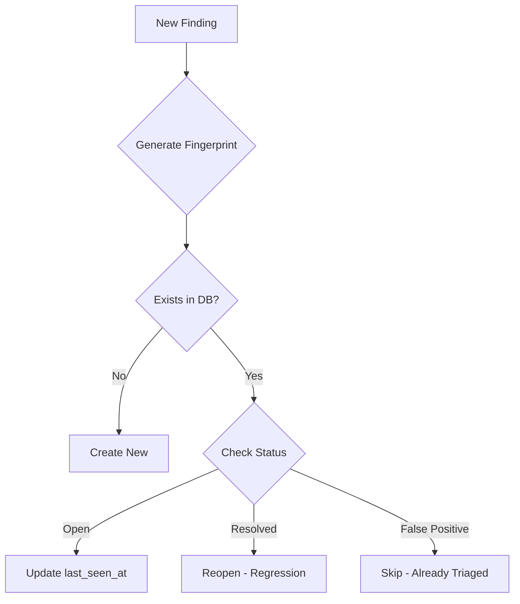

# Finding Deduplication

> **Status**: ✅ Implemented
> **Version**: v1.0
> **Released**: 2026-01-29

## Overview

Finding Deduplication uses type-aware fingerprinting to ensure each unique vulnerability is represented by a single finding, regardless of how many times or by how many scanners it's detected.

## Problem Statement

Without deduplication:
- Same vulnerability reported multiple times = alert fatigue
- Multiple scanners detecting same issue = inflated metrics
- Code refactoring = false "new" findings
- Regression tracking = impossible

## Solution: Fingerprint-Based Deduplication

Each finding type uses a specialized fingerprint algorithm that captures the vulnerability's identity, not its location:



## Fingerprint Strategies

### Strategy Selection

```go
func GetFingerprintStrategy(findingType FindingType, source FindingSource) FingerprintStrategy {
    switch findingType {
    case FindingTypeSecret:
        return &SecretFingerprintStrategy{}
    case FindingTypeCompliance:
        return &ComplianceFingerprintStrategy{}
    case FindingTypeMisconfiguration:
        return &MisconfigFingerprintStrategy{}
    case FindingTypeWeb3:
        return &Web3FingerprintStrategy{}
    default:
        // Select based on source
        switch source {
        case FindingSourceSCA:
            return &SCAFingerprintStrategy{}
        case FindingSourceDAST:
            return &DASTFingerprintStrategy{}
        default:
            return &SASTFingerprintStrategy{}
        }
    }
}
```

### Strategy Components

| Strategy | Version | Components | Resilience |
|----------|---------|------------|------------|
| SAST | `sast/v1` | assetID + ruleID + filePath + normalizedSnippet | Line shifts, reformatting |
| SCA | `sca/v1` | assetID + PURL + CVE + filePath | Version updates |
| DAST | `dast/v1` | assetID + ruleID + endpoint + parameter | URL variations |
| Secret | `secret/v1` | assetID + secretType + service + hash(maskedValue) | Value rotation |
| Compliance | `compliance/v1` | assetID + framework + controlID + filePath | Control updates |
| Misconfig | `misconfig/v1` | assetID + policyID + resourceType + resourcePath | Resource changes |
| Web3 | `web3/v1` | chainID + contractAddress + SWCID + functionSignature | Contract upgrades |

## SAST Fingerprinting

### Snippet Normalization

SAST fingerprints use normalized code snippets instead of line numbers:

```go
func normalizeSnippet(snippet string) string {
    // 1. Split into lines
    // 2. Trim whitespace from each line
    // 3. Join with single space
    // 4. Collapse multiple spaces
    return normalized
}
```

**Example:**
```
Before: "if (user.input)  {\n    execute(user.input);\n}"
After:  "if (user.input) { execute(user.input); }"
```

This makes fingerprints resilient to:
- Whitespace changes
- Line reformatting
- Minor refactoring

### SAST Fingerprint Generation

```go
func (s *SASTFingerprintStrategy) Generate(f *Finding) string {
    h := sha256.New()
    h.Write([]byte(f.assetID.String()))
    h.Write([]byte(f.ruleID))
    h.Write([]byte(f.filePath))
    h.Write([]byte(normalizeSnippet(f.snippet)))
    return hex.EncodeToString(h.Sum(nil))[:32]
}
```

## Secret Fingerprinting

### Security Considerations

The secret fingerprint strategy **never uses raw secrets**:

```go
func (s *SecretFingerprintStrategy) Generate(f *Finding) string {
    h := sha256.New()
    h.Write([]byte(f.assetID.String()))
    h.Write([]byte(f.secretType))
    h.Write([]byte(f.secretService))

    // SECURITY: Only use hash of masked value
    if masked, ok := f.metadata["masked_value"].(string); ok && len(masked) >= 8 {
        maskedHash := sha256.Sum256([]byte(masked))
        h.Write(maskedHash[:8])
    } else {
        // Fallback: use rule + line (no secret exposure)
        h.Write([]byte(f.ruleID))
        fmt.Fprintf(h, "%d", f.startLine)
    }

    h.Write([]byte(f.filePath))
    return hex.EncodeToString(h.Sum(nil))[:32]
}
```

**Security guarantees:**
1. Raw `snippet` field is never used (may contain full secret)
2. Only pre-masked values from scanner are used
3. Masked value is further hashed before inclusion
4. Fallback uses non-sensitive fields only

## Partial Fingerprints

All fingerprint versions are stored for flexibility:

```json
{
  "fingerprint": "abc123def456...",
  "partial_fingerprints": {
    "sast/v1": "abc123def456...",
    "sast/v2": "xyz789...",
    "default/v1": "legacy123..."
  }
}
```

### Benefits

1. **Algorithm Migration**: Switch to v2 without losing state
2. **Multi-Tool Matching**: Different tools may generate different fingerprints
3. **Debugging**: Understand why findings matched or didn't

## Deduplication Logic

### Database Query

```sql
SELECT id, status, resolution
FROM findings
WHERE asset_id = $1
  AND fingerprint = $2
  AND tenant_id = $3
ORDER BY created_at DESC
LIMIT 1
```

### Decision Matrix

| Existing Status | Action | Result |
|-----------------|--------|--------|
| None | Create | New finding |
| new, confirmed, in_progress | Update | Increment `occurrence_count`, update `last_seen_at` |
| resolved | Reopen | Set status=new, resolution_reason="regression" |
| false_positive | Skip | Already triaged as not real |
| accepted | Skip | Risk accepted, don't resurface |
| duplicate | Follow chain | Link to parent finding |

## Cross-Scanner Deduplication

When multiple scanners detect the same issue:

### Configuration

```yaml
# scan-profile.yaml
deduplication:
  strategy: primary_scanner  # or first_seen, highest_severity
  primary: semgrep
```

### Strategies

| Strategy | Description |
|----------|-------------|
| `primary_scanner` | Designated scanner is authoritative |
| `first_seen` | First detection wins |
| `highest_severity` | Keep finding with highest severity |

## API Reference

### Query Duplicates

```
GET /api/v1/findings/{id}/duplicates
```

### Mark as Duplicate

```
POST /api/v1/findings/{id}/mark-duplicate
{
  "parent_id": "uuid-parent"
}
```

### Unlink Duplicate

```
POST /api/v1/findings/{id}/unlink-duplicate
```

## Metrics

### Deduplication Ratio

```sql
SELECT
    COUNT(*) as total_detections,
    COUNT(DISTINCT fingerprint) as unique_findings,
    ROUND(1 - COUNT(DISTINCT fingerprint)::numeric / COUNT(*), 2) as dedup_ratio
FROM findings
WHERE tenant_id = $1
  AND created_at > NOW() - INTERVAL '30 days';
```

### Regression Rate

```sql
SELECT COUNT(*) as regressions
FROM findings
WHERE status IN ('new', 'confirmed')
  AND resolution IS NOT NULL
  AND resolution_reason = 'regression';
```

## Best Practices

### For Scanner Integration

1. **Include PURL** for SCA findings
2. **Provide masked_value** for secrets
3. **Enable taint tracking** for rich snippets
4. **Normalize rule IDs** across versions

### For Operations

1. **Monitor dedup ratio** - should be > 50%
2. **Review false merges** periodically
3. **Track regressions** to catch fix reverts

## Related Documentation

- [Finding Types & Fingerprinting](finding-types.md) - Complete type system
- [Finding Lifecycle](finding-lifecycle.md) - Status transitions
- [Finding Deduplication Guide](../guides/finding-deduplication-workflow.md) - User guide
