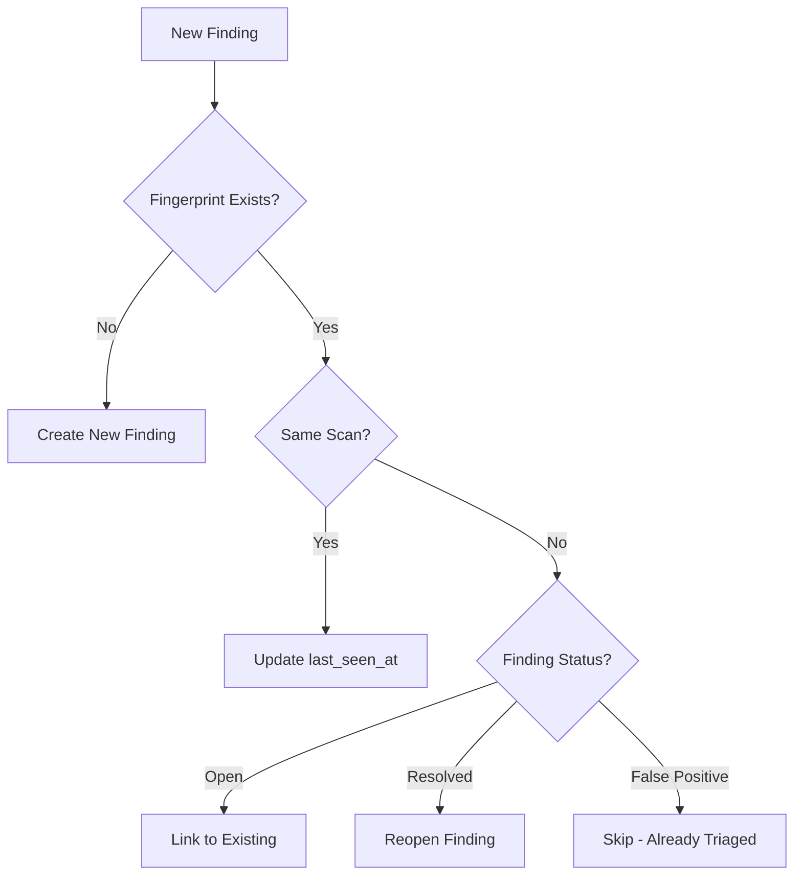

# Finding Deduplication Workflow

{: .note }
> This is a user guide. For technical implementation details, see [Finding Deduplication Feature](../features/finding-deduplication.md).

This guide explains how the platform deduplicates security findings to prevent alert fatigue and maintain accurate metrics.

---

## Overview

Deduplication ensures each unique vulnerability is represented by a single finding, even when:
- Multiple scanners detect the same issue
- The same scan runs repeatedly
- Code is refactored without fixing the vulnerability



---

## Fingerprint-Based Deduplication

### What is a Fingerprint?

A fingerprint is a 32-character hash that uniquely identifies a vulnerability based on its characteristics, not its location.

```
Finding A: SQL injection in user.go:42
Finding B: SQL injection in user.go:58 (after refactoring)

Traditional: Different line = Different finding ❌
Fingerprint: Same code pattern = Same finding ✓
```

### Fingerprint Components by Type

| Finding Type | Components | Why |
|--------------|------------|-----|
| **SAST** | asset + rule + file + normalized_snippet | Code pattern matters, not line number |
| **SCA** | asset + PURL + CVE | Package + vulnerability ID is unique |
| **DAST** | asset + rule + endpoint + parameter | Same endpoint/param = same vuln |
| **Secret** | asset + type + service + hash(masked) | Credential identity, not value |
| **Compliance** | asset + framework + control | Control ID is the identifier |
| **Misconfig** | asset + policy + resource_path | Resource path is stable |
| **Web3** | chain + contract + SWC + function | Contract address is immutable |

---

## Deduplication Scenarios

### Scenario 1: Same Scanner, Same Scan

```
Scan #1 at 10:00 → Finding detected
Scan #1 at 10:00 → Same finding detected again (duplicate in same batch)

Result: Single finding, no duplicate created
```

### Scenario 2: Same Scanner, Different Scans

```
Scan #1 at 10:00 → Finding created (status: new)
Scan #2 at 11:00 → Same fingerprint detected

Result: Update last_seen_at, increment occurrence_count
```

### Scenario 3: Different Scanners, Same Vulnerability

```
Semgrep scan → SQL injection in auth.go
CodeQL scan → SQL injection in auth.go (same pattern)

Result: Single finding, both tools listed in metadata
```

### Scenario 4: Code Refactoring

```
Before refactoring:
  Line 42: if (input != "") { query = "SELECT * FROM users WHERE name='" + input }

After refactoring:
  Line 58: if (input != "") {
             query = "SELECT * FROM users WHERE name='" + input
           }

Result: Same fingerprint (normalized snippet matches), same finding
```

### Scenario 5: Resolved Finding Reappears

```
Day 1: Finding detected, created
Day 2: Developer fixes, finding resolved
Day 3: Fix reverted, same fingerprint detected

Result: Finding reopened with resolution_reason: "regression"
```

---

## Deduplication Algorithm

### Step 1: Generate Fingerprint

```go
func generateFingerprint(finding *Finding) string {
    strategy := GetFingerprintStrategy(finding.Type, finding.Source)
    return strategy.Generate(finding)
}
```

### Step 2: Check Existing Findings

```sql
SELECT id, status, resolution
FROM findings
WHERE asset_id = $1
  AND fingerprint = $2
  AND tenant_id = $3
ORDER BY created_at DESC
LIMIT 1
```

### Step 3: Apply Deduplication Logic

```go
func deduplicate(newFinding, existingFinding *Finding) Decision {
    if existingFinding == nil {
        return CreateNew
    }

    switch existingFinding.Status {
    case StatusNew, StatusConfirmed, StatusInProgress:
        return UpdateExisting  // Update last_seen_at
    case StatusResolved:
        return ReopenExisting  // Regression detected
    case StatusFalsePositive, StatusAccepted:
        return Skip  // Already triaged
    case StatusDuplicate:
        return LinkToParent  // Follow the chain
    }
}
```

---

## Partial Fingerprints

The platform stores multiple fingerprint versions for flexibility:

```json
{
  "fingerprint": "abc123def456...",
  "partial_fingerprints": {
    "sast/v1": "abc123def456...",
    "sast/v2": "xyz789...",
    "default/v1": "legacy123..."
  }
}
```

### Benefits

1. **Algorithm Migration**: Switch to v2 without losing dedup state
2. **Multi-Tool Matching**: Different tools may generate different fingerprints
3. **Debugging**: Understand why findings matched or didn't match

---

## Cross-Scanner Deduplication

When multiple scanners detect the same issue:

### Option 1: Primary Scanner (Default)

```yaml
# scan-profile.yaml
deduplication:
  strategy: primary_scanner
  primary: semgrep
```

Result: Semgrep findings are authoritative; others link to them.

### Option 2: First Seen

```yaml
deduplication:
  strategy: first_seen
```

Result: First scanner to detect keeps the finding.

### Option 3: Highest Severity

```yaml
deduplication:
  strategy: highest_severity
```

Result: Finding with highest severity is kept as primary.

---

## API for Deduplication

### Query Duplicate Findings

```bash
# Find all findings linked to a parent
curl /api/v1/findings/{parent_id}/duplicates

# Response
{
  "parent_id": "uuid-123",
  "duplicates": [
    {"id": "uuid-456", "scanner": "codeql", "linked_at": "..."},
    {"id": "uuid-789", "scanner": "semgrep", "linked_at": "..."}
  ]
}
```

### Force Merge Findings

```bash
# Manually mark as duplicate
curl -X POST /api/v1/findings/{finding_id}/mark-duplicate \
  -d '{"parent_id": "uuid-parent"}'
```

### Unlink Duplicate

```bash
# Separate findings that were incorrectly merged
curl -X POST /api/v1/findings/{finding_id}/unlink-duplicate
```

---

## Metrics and Reporting

### Deduplication Efficiency

```sql
-- Calculate dedup ratio
SELECT
    COUNT(*) as total_detections,
    COUNT(DISTINCT fingerprint) as unique_findings,
    ROUND(1 - COUNT(DISTINCT fingerprint)::numeric / COUNT(*), 2) as dedup_ratio
FROM findings
WHERE tenant_id = $1
  AND created_at > NOW() - INTERVAL '30 days';

-- Result: 1000 detections → 250 unique findings → 75% dedup ratio
```

### Regression Rate

```sql
-- Findings that were resolved but reopened
SELECT COUNT(*) as regressions
FROM findings
WHERE status IN ('new', 'confirmed')
  AND resolution IS NOT NULL
  AND resolution_reason = 'regression';
```

---

## Best Practices

### For Scanner Configuration

1. **Enable taint tracking** for richer fingerprints
2. **Normalize rule IDs** across scanner versions
3. **Include PURL** for dependency findings

### For Deduplication Tuning

1. **Review false merges** periodically
2. **Adjust strategy** based on scanner accuracy
3. **Monitor regression rate** to catch reverts

### For Large Codebases

1. **Batch ingestion** with transaction boundaries
2. **Index optimization** on fingerprint column
3. **Async deduplication** for high-volume scans

---

## Troubleshooting

### Findings Not Deduplicating

**Symptoms**: Same vulnerability appears as multiple findings.

**Causes**:
- Different asset IDs
- Snippet changed significantly
- Rule ID changed between scanner versions

**Solution**:
```sql
-- Compare fingerprint components
SELECT
    f1.id, f1.fingerprint, f1.partial_fingerprints,
    f2.id, f2.fingerprint, f2.partial_fingerprints
FROM findings f1, findings f2
WHERE f1.rule_id = f2.rule_id
  AND f1.file_path = f2.file_path
  AND f1.id != f2.id;
```

### False Deduplication

**Symptoms**: Different vulnerabilities merged into one.

**Causes**:
- Overly generic snippet
- Same endpoint but different parameters
- Hash collision (rare)

**Solution**: Force unlink and adjust fingerprint strategy.

---

## Related Documentation

- [Finding Ingestion Workflow](finding-ingestion-workflow.md) - How findings enter the system
- [Finding Types & Fingerprinting](../features/finding-types.md) - Fingerprint algorithms
- [Finding Lifecycle](../features/finding-lifecycle.md) - Status transitions
