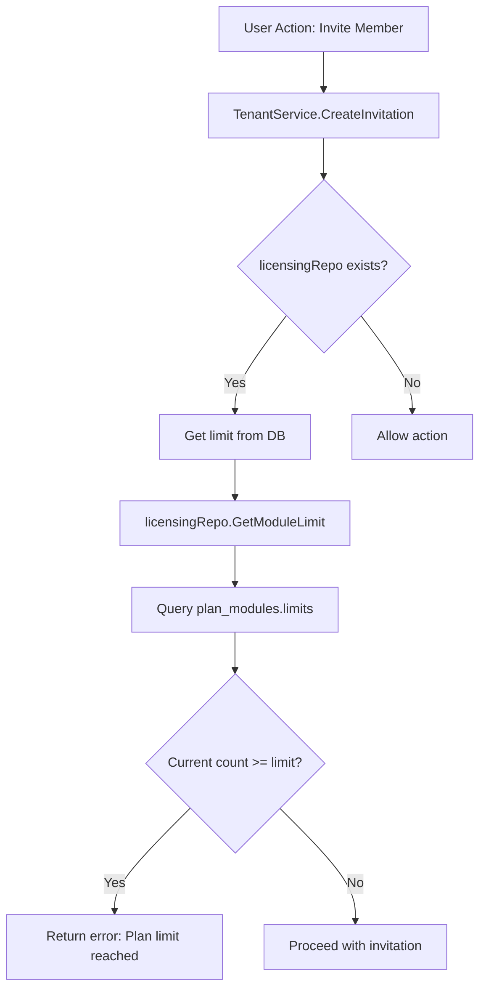

# Dynamic Plan Limits System

> Database-driven subscription limits that can be updated without code deployment

## Overview

The Dynamic Plan Limits system allows administrators to configure and modify subscription plan limits (e.g., max members, max assets, max scans) directly in the database without requiring code changes or redeployment. This provides maximum flexibility for adjusting pricing tiers and limits in production.

## Current Plan Structure (4 Tiers)

The system uses a streamlined 4-tier subscription model:

| Plan | Price (Monthly) | Max Members | Max Assets | Max Scans/Month | Key Features |
|------|-----------------|-------------|------------|-----------------|--------------|
| **Free** | $0 | 3 | 50 | 20 | Community support, Basic dashboard |
| **Team** | $499 | 10 | 1,000 | 500 | Email support, Audit logs, API access |
| **Business** | $1,499 | 50 | 10,000 | 5,000 | Priority support, SSO, Compliance frameworks |
| **Enterprise** | Custom | Unlimited | Unlimited | Unlimited | Dedicated support, SLA, Custom integrations |

### Why 4 Tiers?

Previously, the system had 5 tiers (Free, Pro, Team, Business, Enterprise), which created customer confusion due to overlap between Pro and Team tiers. The consolidated 4-tier model:
- **Reduces choice paralysis** (well-documented SaaS best practice)
- **Clear positioning**: Free → Team (startups) → Business (scaling) → Enterprise (large orgs)
- **Easier to communicate** and maintain

## Database Schema

### Plans Table

```sql
CREATE TABLE plans (
    id UUID PRIMARY KEY,
    slug VARCHAR(50) UNIQUE NOT NULL,  -- 'free', 'team', 'business', 'enterprise'
    name VARCHAR(100) NOT NULL,
    price_monthly DECIMAL(10, 2),
    price_yearly DECIMAL(10, 2),
    -- ... other fields
);
```

### Plan Modules Table (Limits Storage)

Limits are stored in the `limits` JSONB column:

```sql
CREATE TABLE plan_modules (
    plan_id UUID REFERENCES plans(id),
    module_id VARCHAR(50),  -- 'team', 'assets', 'scans'
    limits JSONB DEFAULT '{}',  -- {"max_members": 10, "max_assets": 1000}
    PRIMARY KEY (plan_id, module_id)
);
```

### Current Limits Configuration

```sql
-- Example: Team plan limits
SELECT p.slug, m.slug AS module, pm.limits 
FROM plan_modules pm
JOIN plans p ON pm.plan_id = p.id
JOIN modules m ON pm.module_id = m.id
WHERE p.slug = 'team' AND m.slug IN ('team', 'assets', 'scans');

-- Result:
--  plan  | module |        limits
-- -------+--------+------------------------
--  team  | team   | {"max_members": 10}
--  team  | assets | {"max_assets": 1000}
--  team  | scans  | {"max_scans": 500}
```

## How It Works

### Architecture Flow



### Code Implementation

**1. Fetching Limits (Repository Layer)**

```go
// GetModuleLimit returns the effective limit for a module metric
func (r *LicensingRepository) GetModuleLimit(ctx context.Context, tenantID uuid.UUID, moduleID, metric string) (int64, error) {
    // First check tenant's limits override
    tenantQuery := `SELECT limits_override FROM tenants WHERE id = $1`
    // ... check override logic
    
    // Fall back to plan limits
    planQuery := `
        SELECT pm.limits
        FROM plan_modules pm
        JOIN tenants t ON t.plan_id = pm.plan_id
        WHERE t.id = $1 AND pm.module_id = $2
    `
    // Parse JSONB and extract metric value
    // Return -1 for unlimited
}
```

**2. Enforcing Limits (Service Layer)**

```go
// CreateInvitation with limit enforcement
func (s *TenantService) CreateInvitation(ctx context.Context, ...) (*tenant.Invitation, error) {
    // ... validation logic
    
    // Check plan limits
    if s.licensingRepo != nil {
        tid, _ := uuid.Parse(tenantID)
        limit, err := s.licensingRepo.GetModuleLimit(ctx, tid, "team", "max_members")
        if err == nil && limit >= 0 { // -1 means unlimited
            stats, _ := s.repo.GetMemberStats(ctx, parsedID)
            currentCount := stats.TotalMembers + stats.PendingInvites
            if int64(currentCount) >= limit {
                return nil, fmt.Errorf("plan limit reached (max %d members). Please upgrade your plan.", limit)
            }
        }
    }
    
    // Proceed with invitation creation
}
```

## Updating Limits (No Code Deploy Required!)

### Example: Increase Team Plan Members to 15

```sql
UPDATE plan_modules 
SET limits = '{"max_members": 15}'::jsonb
WHERE plan_id = (SELECT id FROM plans WHERE slug = 'team')
AND module_id = 'team';
```

### Example: Add a New Limit Metric

```sql
-- Add max_api_calls limit to Business plan
UPDATE plan_modules 
SET limits = limits || '{"max_api_calls": 100000}'::jsonb
WHERE plan_id = (SELECT id FROM plans WHERE slug = 'business')
AND module_id = 'api_keys';
```

### Example: Set Unlimited Scans for Business

```sql
UPDATE plan_modules 
SET limits = '{"max_scans": -1}'::jsonb
WHERE plan_id = (SELECT id FROM plans WHERE slug = 'business')
AND module_id = 'scans';
```

### Example: Tenant-Specific Override

For special enterprise customers who need custom limits:

```sql
UPDATE tenants 
SET limits_override = '{"max_members": 200, "max_assets": 50000}'::jsonb
WHERE slug = 'acme-corp';
```

## Benefits

| Feature | Before (Hardcoded) | After (Dynamic) |
|---------|-------------------|-----------------|
| **Update Limits** | Edit Go code → Compile → Deploy → Restart | Single SQL query → Instant |
| **Downtime** | Service restart required | Zero downtime |
| **Rollback** | Git revert → Full deploy | Simple SQL UPDATE |
| **A/B Testing** | Impossible | Easy with tenant overrides |
| **Custom Deals** | Code fork or special build | `limits_override` column |

## Migration History

### 000068: Drop Tenant Plan Column
- Removed redundant `plan` string column from `tenants` table
- Enforced use of `plan_id` foreign key for all operations
- Ensured data consistency between code and database

### 000069: Add Team Plan
- Created the "Team" plan tier
- Assigned appropriate modules to Team plan
- Positioned between Free and Business

### 000070: Consolidate Plans
- Migrated Pro plan users to Team plan (upgrade)
- Removed Pro plan from system
- Re-ordered display_order (1-4)

### 000071: Set Plan Limits
- Populated `limits` JSONB in `plan_modules` table
- Set initial values for all 4 tiers
- Format: `{"max_members": N, "max_assets": N, "max_scans": N}`

## Enforcement Points

The system currently enforces `max_members` limit at:

1. **`TenantService.CreateInvitation`**: Checks before creating email invitation
2. **`TenantService.AddMember`**: Checks before directly adding a member

### Future Enforcement Points (TODO)

- `max_assets`: Check in `AssetService.CreateAsset`
- `max_scans`: Check in `ScanService.CreateScan`
- `max_api_calls`: Middleware rate limiting
- `max_storage`: File upload validation

## Monitoring & Analytics

### Check Current Usage vs Limits

```sql
SELECT 
    t.slug AS tenant,
    p.slug AS plan,
    COUNT(tm.*) AS current_members,
    (pm.limits->>'max_members')::int AS max_members,
    CASE 
        WHEN (pm.limits->>'max_members')::int = -1 THEN 'Unlimited'
        ELSE ROUND((COUNT(tm.*) * 100.0 / (pm.limits->>'max_members')::int), 2)::text || '%'
    END AS usage_pct
FROM tenants t
JOIN plans p ON t.plan_id = p.id
JOIN plan_modules pm ON pm.plan_id = p.id AND pm.module_id = 'team'
LEFT JOIN tenant_members tm ON tm.tenant_id = t.id
GROUP BY t.slug, p.slug, pm.limits
ORDER BY current_members DESC;
```

### Tenants Near Limits (Upsell Opportunities)

```sql
SELECT 
    t.slug,
    COUNT(tm.*) AS members,
    (pm.limits->>'max_members')::int AS max_members
FROM tenants t
JOIN plan_modules pm ON pm.plan_id = t.plan_id AND pm.module_id = 'team'
LEFT JOIN tenant_members tm ON tm.tenant_id = t.id
GROUP BY t.slug, pm.limits
HAVING (pm.limits->>'max_members')::int > 0 
AND COUNT(tm.*) >= (pm.limits->>'max_members')::int * 0.8;
```

## Best Practices

### 1. Always Use -1 for Unlimited
```sql
-- ✅ Correct
{"max_members": -1}

-- ❌ Wrong
{"max_members": 999999}
```

### 2. Keep Limits in plan_modules, Use Overrides for Exceptions
```sql
-- ✅ Standard limits in plan_modules
UPDATE plan_modules SET limits = '{"max_members": 50}'::jsonb WHERE ...;

-- ✅ Special customer override
UPDATE tenants SET limits_override = '{"max_members": 100}'::jsonb WHERE slug = 'vip-customer';
```

### 3. Document Limit Changes
```sql
-- Add a changelog comment
-- 2026-01-23: Increased Team max_members from 10 to 15 per product decision #1234
UPDATE plan_modules SET limits = '{"max_members": 15}'::jsonb WHERE ...;
```

## Troubleshooting

### Error: "Plan limit reached"

**Cause**: User tried to invite member but tenant has reached `max_members` limit.

**Solutions**:
1. Upgrade tenant's plan
2. Remove inactive members
3. Apply tenant-specific override (if justified)

### Limit Not Enforced

**Checklist**:
- [ ] Is `licensingRepo` injected in `TenantService`?
- [ ] Does the `plan_modules` table have limits for this module?
- [ ] Is the limit formatted correctly in JSONB?
- [ ] Check logs for errors in `GetModuleLimit`

### Unlimited Not Working

**Check**:
```sql
-- Should return -1 for unlimited
SELECT limits->>'max_members' FROM plan_modules 
WHERE plan_id = (SELECT id FROM plans WHERE slug = 'enterprise')
AND module_id = 'team';
```

## See Also

- [Plans & Licensing System](./plans-licensing.md) - Full licensing architecture
- [Database Schema](../database/schema.md) - Complete schema documentation
- [Migrations Guide](../database/migrations.md) - How to create and run migrations
